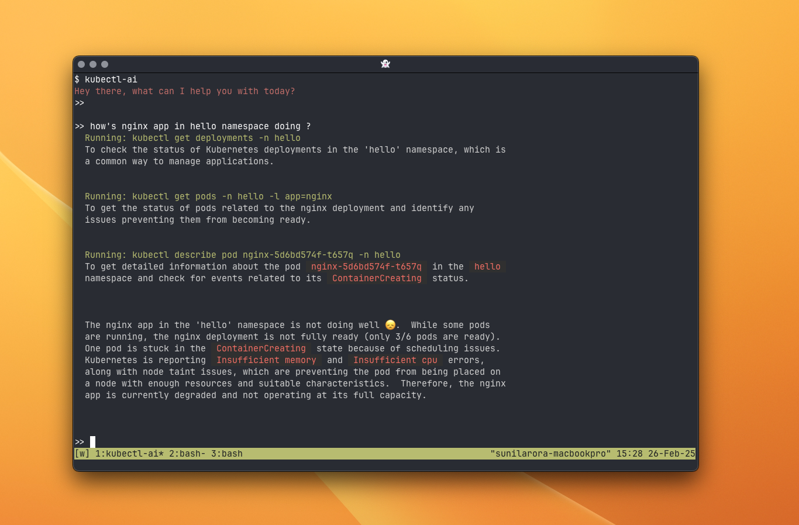

# kubectl-ai

## Overview

kubectl-ai is a kubernetes assistant that enhances the Kubernetes command-line experience using AI capabilities. It leverages Large Language Models (LLMs) such as Gemini to help users interact with Kubernetes clusters more efficiently.



## Installation

### Prerequisites

- Go 1.23 or later
- kubectl installed and configured
- Access to a Gemini API Key (or other supported AI models)

### Install from Source

```bash
# Clone the repository
git clone https://github.com/GoogleCloudPlatform/kubectl-ai.git
cd kubectl-ai

# Build and install
dev/tasks/install
```

### Invoking

`kubectl-ai` can be launched in two ways:

- Run the binary `kubectl-ai` 
- Use it via the `kubectl` plug interface like this: `kubectl ai`.  kubectl will find `kubectl-ai` as long as it's in your PATH.  For more information about plugins please see: https://kubernetes.io/docs/tasks/extend-kubectl/kubectl-plugins/ 

In the examples below we will use `kubectl-ai` invocation method.

### Environment Setup

Set up Gemini API key as follows:

```bash
export GEMINI_API_KEY=your_api_key_here
```

Get your API key from [Google AI Studio](https://aistudio.google.com) if you don't have one.

## Usage

Once installed, you can use kubectl-ai in two ways:

### Command Line Query

Simply provide your query as a positional argument:

```bash
kubectl-ai "your natural language query"
```

You can also pipe content to kubectl-ai, and use it with other unix commands:

```bash
kubectl-ai < query.txt
# OR
echo "list all pods in the default namespace" | kubectl-ai
```

You can even combine a positional argument with stdin input. The positional argument will be used as a prefix to the stdin content:

```bash
cat error.log | kubectl-ai "explain the error"
```

### Interactive Shell

If you run kubectl-ai without providing a query, it launches an interactive chat-like shell:

```bash
kubectl-ai
```

This interactive mode allows you to have a conversation with the AI assistant, asking multiple questions in sequence while maintaining context from previous interactions. Simply type your queries and press Enter to receive responses. To exit the interactive shell, type `exit` or press Ctrl+C.

You can also use the following keywords for specific actions:

* `model`: Display the currently selected model.
* `models`: List all available models.
* `version`: Display the `kubectl-ai` version.
* `reset`: Clear the conversational context.
* `clear`: Clear the terminal screen.
* `exit` or `quit`: Terminate the interactive shell (Ctrl+C also works).

### Examples

```bash
# Get information about pods in the default namespace
kubectl-ai "show me all pods in the default namespace"

# Create a new deployment
kubectl-ai "create a deployment named nginx with 3 replicas using the nginx:latest image"

# Troubleshoot issues
kubectl-ai "double the capacity for the nginx app"
```

The `kubectl-ai` assistant will process your query, execute the appropriate kubectl commands, and provide you with the results and explanations.

Note: This is not an officially supported Google product. This project is not
eligible for the [Google Open Source Software Vulnerability Rewards
Program](https://bughunters.google.com/open-source-security).
