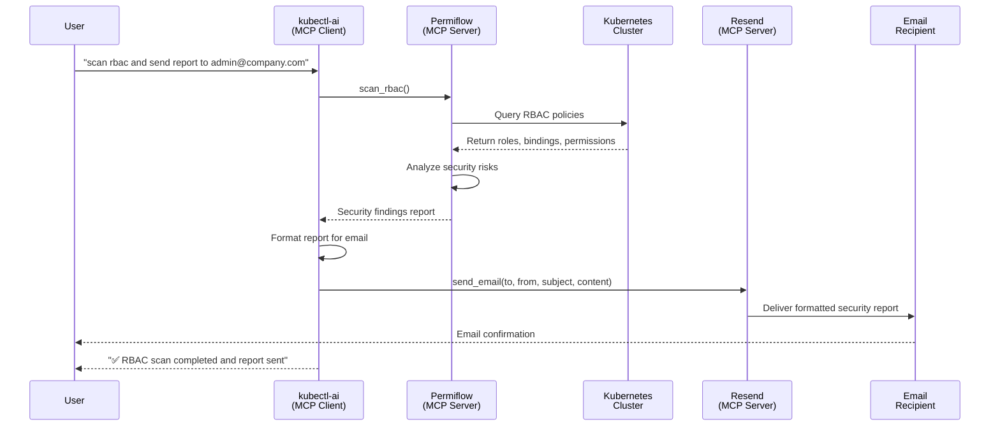

# kubectl-ai MCP Client Integration

## Multi-Server Orchestration for Security Automation

The MCP (Model Context Protocol) Client feature enables kubectl-ai to coordinate multiple specialized tools through natural language commands. This integration demonstrates automated security workflows that combine RBAC scanning with email reporting.

**Problem**: Traditional security audits require manual execution of multiple tools, data correlation, and report distribution—a time-consuming process prone to human error.

**Solution**: Single command orchestration across multiple MCP servers:

```bash
kubectl-ai --mcp-client --quiet "scan rbac and send urgent report to incident-team@company.com from sender@company.com"
```

**Architecture Components:**

- **kubectl-ai**: Central orchestrator interpreting natural language commands
- **Permiflow**: RBAC security scanning and analysis
- **Resend**: Automated email delivery service
- **Additional servers**: Documentation, reasoning, and extensible integrations

## Workflow Sequence Diagram



## Execution Flow

The command execution follows this sequence:

1. **kubectl-ai** parses the natural language request
2. [**Permiflow**](https://github.com/tutran-se/permiflow) performs comprehensive RBAC analysis across cluster resources
3. [**Resend**](https://github.com/resend/mcp-send-email) formats and delivers the security report via email

**Extensibility**: The architecture supports additional MCP servers for Slack notifications, Jira ticket creation, compliance databases, and custom integrations.

## Configuration and Setup

### MCP Server Configuration

Configure the MCP servers in `~/.config/kubectl-ai/mcp.yaml`:

```yaml
Servers:
- Args:
  - '~/mcp-send-email/build/index.js'
  env:
    RESEND_API_KEY: "api-key-here"
  Command: node
  Name: resend
- Name: permiflow
  URL: http://localhost:8080/mcp

```

### Quick Start

```bash
# 1. Start the Permiflow MCP server
permiflow mcp --transport http --http-port 8080

# 2. Execute kubectl-ai with MCP client enabled
kubectl-ai --mcp-client --quiet "scan rbac and send report to admin@company.com from sec@company.com"
```

## Automation Use Cases

### Scheduled Security Monitoring

Implement automated daily security scans using cron:

```bash
# Daily RBAC audit at 9 AM
0 9 * * * kubectl-ai --mcp-client --quiet "scan rbac and send daily report to admin@company.com from sec@company.com"
```

### Incident Response

Execute immediate security assessments during incidents:

```bash
kubectl-ai --mcp-client --quiet "scan rbac for production namespace and send urgent report to incident-team@company.com from sec@company.com"
```

## Usage Examples

### Interactive Mode

Launch kubectl-ai in interactive mode for exploratory analysis:

```bash
kubectl-ai --mcp-client
>>> "scan rbac and send report to admin@company.com"
>>> "analyze RBAC for kubeflow namespace"
>>> "show me the most dangerous permissions in production"
>>> "which service accounts can access secrets across namespaces?"
```

### Direct Commands

Execute specific security queries directly:

```bash
kubectl-ai --mcp-client "show wildcard permissions and suggest fixes"
```

## Extended Integration

### Additional MCP Servers

Expand the automation capabilities by adding specialized servers:

```yaml
Servers:
  - Name: slack-notifier
    URL: "https://slack-mcp.company.com/mcp"
  - Name: jira-tickets
    URL: "https://jira-mcp.company.com/mcp"
  - Name: trivy-scanner
    Command: npx
    Args: ["-y", "@aquasecurity/trivy-mcp"]
```

### Advanced Workflows

**Multi-Channel Incident Response:**

```bash
"scan rbac, create jira ticket, email security team, post to slack"
```

**Compliance Automation:**

```bash
"scan vulnerabilities, update compliance database, email leadership"
```

## Benefits

- **Unified Interface**: Single natural language interface for multiple tools
- **Automation**: Reduces manual security audit processes
- **Consistency**: Standardized security scanning and reporting
- **Extensibility**: Modular architecture supports additional integrations
- **Efficiency**: Rapid security assessment and stakeholder notification
